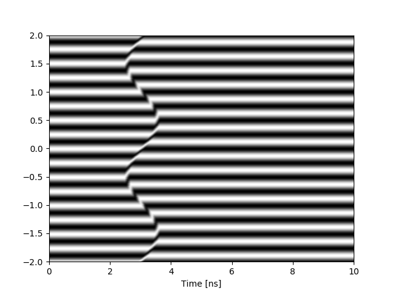

# Simulate Line-VISAR data

Building simulated data from a velocity profile.

## Simple Example

~~~python
target = Target(velocity_equation="step")
    
ray = Ray(pulse_length=10)
ray = target.reflect_off_target(ray)
    
etalon = Etalon(1, 1.5195)
etalon.set_VPF(2., lambda0=.532)
interferometer = Interferometer(etalon=etalon)
    
sweep = interferometer.output(ray, target)

plt.figure()
plt.imshow(sweep, aspect='auto', cmap="gray", extent=(0, 10, -2, 2))
plt.xlabel("Time [ns]")
~~~

## Target class

The target class defines the velocity profile that will be recorded by the visar system (i.e. the shock front moving / interface velocity of a target of interest).

This velocity profile is loaded during the initilization of the target instance. Two built-in profiles are availible for testing.  

 - `step` : a discontinious velocity jump
 - `sigmoid` : a sigmoid-shaped velocity jump
 - `stationary` : 0 velocity change, used in generating reference images

To help visulize the velocity profile, a helper plotting function is availible, and can be called via the following command:

~~~python
target.plot_velocity()
~~~

This generates two plots: a 3D plot of the velocity profile, and a 2D color plot. The 2D should be identical to what the "Visar analysis" script would return for the velocity map, if this simulated data were to be analyzed. 

### Loading a generic velocity profile

User-defined velocity profiles can be loaded. An example of how this is done is demonstrated in the functions

 - `sin_step`
 - `spatial_var_step`

In this case, a callable function is defined, which must except a time value, and a spatial location. If the user defined function requires more argments, this can be simlified with use of a `lambda` function. e.g.

~~~python
velocity_equation = lambda t, y : sin_step(20, .5, t, y, max_velocity=1)
~~~

the function is then loaded into the target during the initilization of the target instance.

~~~python
target = Target(velocity_equation=velocity_equation)
~~~

 
## Ray class

The `ray` instance defines the duration, as well as the spatial location over which the velocity profile will be recorded.

The values must be less than `target._t` and `target._y`, currently these are hard-coded into the `Target.__init__`, feel free to change them.

## Etalon class

The `etalon` instance sets the VPF of the generated visar data, determined by twice the thickness (two passes through the etalon for a mach-zender interferometer) and the index of refraction:

~~~python
etalon = Etalon(thickness=1, n=1.5195)
~~~ 

If you would like to explicitly set the VPF instead, this can be done with the helper function `set_VPF`, this then chanced the etalon thickness:

~~~python
etalon.set_VPF(2, labda0=.532)
~~~ 

Similarly, this can be done with the etalon tau (temporal delay, in ns), `set_tau`

## Interferometer class

The interferometer instance will carry out the mechanics of generating the fringe-comb pattern. 

Initilization of the interferometer instance requires 2 arguments. 

~~~python
Interferometer(
    etalon,
    tau,
)
~~~

 - `etalon` An Etalon instance, used in determining the VPF of the generated data
 - `tau` the slit opening on the streak camera, this sets the temporal resolution. 

Generation of the desired data is then acomplished by calling the `output` class method.  

~~~python
sweep = interferometer.output(ray, target, noise=False)
~~~

`output` excepts a `Ray` argument and a `Target` argument, and optional booliean argument to add noise to the generated data is also availible; however, this method is still in development. 

## Reference Shot

A helper function is included to quickly generate a reference shot. This just generates the output from a stationalry target.

~~~python
reference_shot(
    save=False,
    noise=False
)
~~~

